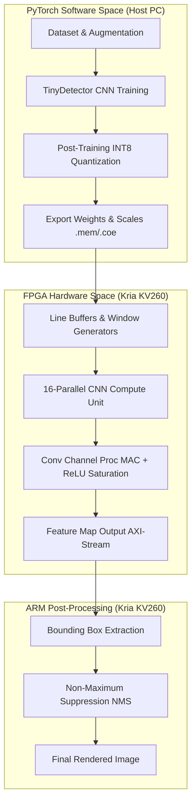

# CNN Accelerator on fpga

## Project Details and End-to-End Pipeline
This project presents an end-to-end framework for deploying a highly parallelized Convolutional Neural Network (CNN) onto an FPGA. The goal is to accelerate object detection inferences on edge devices by moving complex tensor calculations from the software domain (ARM processor) directly into dedicated hardware (Programmable Logic). 

The pipeline begins with a lightweight PyTorch CNN called `TinyDetector`, specifically designed for bounding-box regression with minimal parameters. Once trained on a custom dataset, the model undergoes Post-Training Quantization (PTQ) to convert all floating-point weights and activations into 8-bit integers (INT8). This step is critical, as fixed-point arithmetic significantly reduces the hardware footprint and latency on the FPGA. Symmetric quantization and custom scaling factors are employed to maintain model accuracy and ensure seamless zero-point handling.

After quantization, the neural network architecture is translated into Verilog RTL. The hardware design is highly customized around a 16-parallel Processing Element (PE) matrix, accelerating channel-wise convolutions. Vivado is used to package these modules, attach AXI-Stream interfaces, and synthesize the bitstream (`.bit`) for the Xilinx Kria KV260 platform. Finally, the PYNQ framework is utilized on the KV260 board running Ubuntu 22.04 to stream images to the hardware accelerator, retrieve the computed feature maps, apply Non-Maximum Suppression (NMS), and render the final bounding boxes onto the image in real-time.

### Pipeline Architecture

## System Performance & Implementation Results

### FPGA Resource Utilization (Kria KV260)
The 16-parallel hardware engine is synthesized on the Zynq UltraScale+ programmable logic. The following table (derived from the Vivado implementation run) highlights the highly efficient hardware utilization, leaving ample logic for future architectural expansion.

| Resource | Used | Available | Utilization (%) |
|----------|------|-----------|-----------------|
| LUT | 14,005 | 117,120 | 11.96% |
| FF | 21,421 | 234,240 | 9.15% |
| BRAM (36Kb)| 98 | 144 | 68.06% |
| DSP | 419 | 1,248 | 33.57% |

### Inference Latency Comparison
The execution pipeline runs all convolutional layers (Layers 1-7) deeply pipelined on the FPGA fabric, while only the bounding box extraction, NMS, and post-processing run on the embedded ARM Cortex-A53 processor.

| Execution Platform | Total Conv Time (ms) | Frames Per Second (FPS) |
|--------------------|----------------------|-------------------------|
| ARM Cortex-A53 (Pure Software) | ~2200.0 | 0.45 |
| **FPGA Execution** | **76.5** | **13.1** |

This yields a **28x speedup** in convolutional inference time by utilizing the Programmable Logic.

## Hardware Modules

### `cnn_pipeline_top.v`
This top-level module serves as the primary wrapper for the entire CNN accelerator, interfacing directly with the outside world via AXI-Stream protocols. It orchestrates the flow of incoming image data and outgoing detection bounding boxes, maintaining pipeline synchronization and ensuring no data loss occurs between the processor and the programmable logic.

The module connects the internal line buffers, window generators, and the core compute unit. It handles all control signals, ensuring data validity across the clock boundaries and seamlessly managing backpressure from downstream AXI components so the accelerator does not stall unexpectedly.

### `cnn_compute_unit.v`
This module acts as the primary parallel processing engine of the CNN accelerator. It instantiates multiple individual channel processing elements and aggregates their results to compute the final output activations, making it the mathematical core of the design.

By employing 16-parallelism, the compute unit drastically increases throughput compared to a traditional serial approach. It reads localized feature map windows and corresponding weights simultaneously, producing multiple channels of output in a single clock cycle to achieve maximum hardware utilization.

### `conv_channel_proc.v`
Operating at the lowest level of the compute hierarchy, this module is responsible for the actual multiply-accumulate (MAC) arithmetic for a single output channel. It performs precise 8-bit signed and unsigned multiplications between input activations and layer weights.

Additionally, this module integrates the crucial non-linear activation function (ReLU) and saturation logic. By accurately clamping mathematical results to the `[0, 127]` range, it ensures the INT8 datatype properties are strictly maintained, preventing overflow errors in deeper network layers.

### `conv_engine.v`
The convolution engine abstracts the sliding window process, systematically stepping through the feature map and providing the necessary operands to the downstream compute units. It coordinates the traversal logic, shifting the operation window correctly across rows and columns.

This module significantly simplifies the control logic overhead from the main processing path. By systematically and continuously feeding the MAC arrays with the correct sequences of data, it maintains the high utilization rate of the spatial multipliers.

### `line_buffer.v`
Crucial for optimizing memory bandwidth, the line buffer caches incoming sequential pixel data streams to construct localized 2D patches. This entirely eliminates the need to fetch the same pixel multiple times from external DDR memory, which would otherwise be a massive bottleneck.

By acting as a First-In-First-Out (FIFO) queue for entire rows of an image, it ensures that as a new pixel arrives, an entire column of the sliding window can be updated instantly. This allows continuous streaming operations without data stalling.

### `window_gen_3x3.v` / `window_gen_4x4.v`
The window generator modules work in tandem with the line buffers to extract the specific 3x3 or 4x4 spatial patch required by the convolution kernel at any given clock cycle. They assemble the newly cached rows into a contiguous, easily readable 2D array.

This hardware logic ensures that the `cnn_compute_unit` is always presented with valid, aligned data. It strictly manages the boundary padding, ensuring zero values are properly injected when the convolution filter operates at the edges of the image.

## Machine Learning Modules

### `model.py`
This script defines the `TinyDetector` convolutional neural network architecture using PyTorch. It is designed to be a lightweight regression model that processes spatial features using successive convolutions, max pooling, and a dense head to directly output bounding box coordinates and class confidences.

By keeping the parameter count low, the model ensures inference can easily fit into the programmable logic of the FPGA. The architecture strictly uses modules that can be deterministically quantized, avoiding unsupported operations that complicate the hardware transformation.

### `dataset.py`
This module manages the data loading pipeline for training the model. It defines a custom PyTorch Dataset class that parses image files, normalizes input tensors, and standardizes corresponding target bounding box annotations for efficient batched loading.

To prevent the model from overfitting and to improve generalization, the dataset class also implements crucial data augmentation strategies. These preprocessing steps ensure robust feature extraction during the neural network's forward passes.

### `train.py`
The primary script for optimizing the `TinyDetector` network. It orchestrates the training loop, defining the loss function tailored for combined coordinate regression and confidence scoring, and utilizes the Adam optimizer to update model weights over multiple epochs.

It continuously monitors performance by evaluating the loss on a separate validation set, utilizing learning rate scheduling to ensure convergence. Upon completion, it exports the trained floating-point weights, laying the groundwork for the quantization phase.

### `quantize_int8.py`
This crucial script performs Post-Training Quantization (PTQ) on the trained floating-point model. It converts the full-precision weights and activations into 8-bit integers (INT8), a necessary step to drastically reduce the size and power requirements of the hardware deployment.

By utilizing symmetric quantization, the script simplifies the arithmetic zero-points for the Verilog MAC units. It also calculates and explicitly exports the hardware-specific layer scaling factors and integer biases into `.mem` and `.coe` formats for direct consumption by the Vivado synthesis tool.

### `detect_realtime.py` & `detection_utils.py`
These scripts handle the software-side inference and post-processing of the model's outputs. They implement Non-Maximum Suppression (NMS) to filter redundant detections, ensuring only the most confident and unique bounding boxes are rendered onto the output image.

While `detection_utils.py` provides the core mathematical functions for intersection-over-union (IoU) and coordinate un-scaling, `detect_realtime.py` wraps these utilities into a clean interface. It allows for quick visualization of the network's predictive capabilities before hardware offloading.

## Repository Structure
- **`src/ml/`**: Contains the core Python machine learning logic described above.
- **`src/verilog/`**: Contains the custom RTL source code modules.
- **`src/kria_deployment/`**: Contains execution scripts (`run_arm.py` and `run_fpga.py`) along with the exported weight configuration files to run the accelerator directly on the physical Kria KV260 board.
