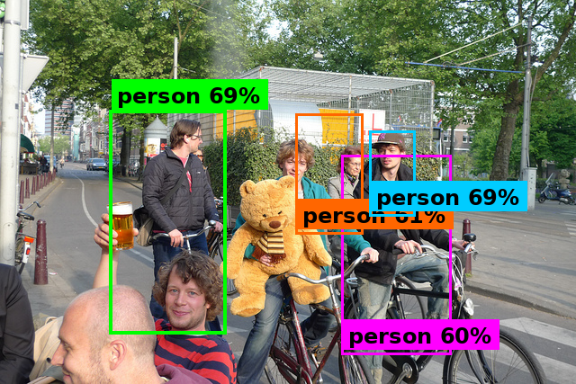

# Hardware Accelerated CNN on Kria KV260

## What This Project Does
We built a custom CNN accelerator in Verilog and deployed it on the Xilinx Kria KV260 FPGA board. The idea is simple — instead of running convolutions on a slow ARM CPU, we wrote our own hardware to do it in parallel, directly on the FPGA fabric.

The network (`TinyDetector`) is a small 7-layer CNN that detects objects (people) in images using bounding boxes. We trained it in PyTorch, quantized the weights to 8-bit integers, exported them as `.mem` files, and loaded them into our custom Verilog pipeline on the board.

## How It Works

1. **Train** the CNN in PyTorch on a person detection dataset
2. **Quantize** all weights and activations to INT8 using post-training quantization
3. **Export** the quantized weights as `.mem` / `.coe` files that Vivado can read
4. **Synthesize** our custom Verilog RTL in Vivado, generate the bitstream
5. **Deploy** on the Kria KV260 using PYNQ — stream images to FPGA, get feature maps back, draw bounding boxes on the ARM side

### Pipeline Overview

```
Training (Host PC)
  Dataset & Augmentation
       |
  Train TinyDetector
       |
  INT8 Quantization
       |
  Export .mem/.coe Weights
       |
       v
FPGA (Kria KV260)
  Line Buffers & Window Generators
       |
  16-Parallel Compute Unit
       |
  MAC + ReLU + Saturation
       |
  Output via AXI-Stream
       |
       v
ARM Post-Processing
  Bounding Box Decode
       |
  NMS
       |
  Final Image
```

## Results

### FPGA Resource Usage
Our 16-parallel design fits comfortably on the KV260. BRAM usage is the tightest resource since we store line buffers and weight caches on-chip.

| Resource | Used | Available | Usage |
|----------|------|-----------|-------|
| LUT | 14,005 | 117,120 | ~12% |
| FF | 21,421 | 234,240 | ~9% |
| BRAM (36Kb) | 98 | 144 | ~68% |
| DSP | 419 | 1,248 | ~34% |

### Speed Comparison
All 7 conv layers run on the FPGA. The ARM only handles the lightweight post-processing (decode + NMS + drawing).

| Platform | Conv Time | FPS |
|----------|-----------|-----|
| ARM Cortex-A53 (software only) | ~2200 ms | 0.45 |
| **Our FPGA accelerator** | **76.5 ms** | **13.1** |

> **Note:** The FPGA inference time is measured at a **100 MHz clock frequency** on the Kria KV260 fabric.

That's roughly a **28x speedup** over pure software.


*Iverilog RTL simulation output:*



## Verilog Modules

| File | What it does |
|------|-------------|
| `cnn_pipeline_top.v` | Top-level wrapper. Hooks everything up to AXI-Stream DMA so the ARM can send/receive data. |
| `cnn_compute_unit.v` | The main compute block. Runs 16 channels in parallel per clock cycle. |
| `conv_channel_proc.v` | Does the actual multiply-accumulate math for one channel. Also handles ReLU and clamps output to [0, 127]. |
| `conv_engine.v` | Manages the sliding window — feeds the right pixels and weights to the compute unit each cycle. |
| `line_buffer.v` | Stores rows of pixels in BRAM so we don't have to keep fetching from DDR. |
| `window_gen_3x3.v` | Builds 3x3 patches from the line buffer output for the conv kernel. |
| `window_gen_4x4.v` | Same idea but for 4x4 patches (used in the first layer with stride 2). |

## Python Scripts

| File | What it does |
|------|-------------|
| `model.py` | Defines the TinyDetector CNN architecture in PyTorch. |
| `dataset.py` | Loads images and annotations, applies augmentations. |
| `train.py` | Training loop with Adam optimizer, saves best checkpoint. |
| `quantize_int8.py` | Converts trained float weights to INT8, exports `.mem` and `.coe` files. |
| `detect_realtime.py` | Runs inference and draws bounding boxes for testing. |
| `detection_utils.py` | Helper functions for NMS, IoU calculation, coordinate scaling. |
| `config.py` | Shared constants (image size, class names, paths). |


## How to Run on the Kria KV260

```bash
# On the board (Ubuntu 22.04 + PYNQ installed)
cd /home/ubuntu/cnn_accelerator
python3 run_fpga.py
```

Make sure the bitstream (`.bit`) and weight files are in the same directory.

## Built With
- PyTorch (training & quantization)
- Vivado (synthesis & bitstream generation)
- PYNQ (FPGA-ARM communication)
- Icarus Verilog (RTL simulation & verification)
